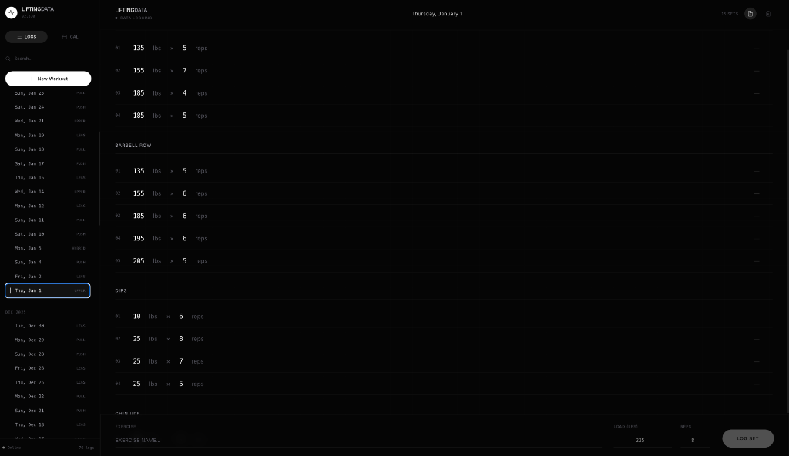
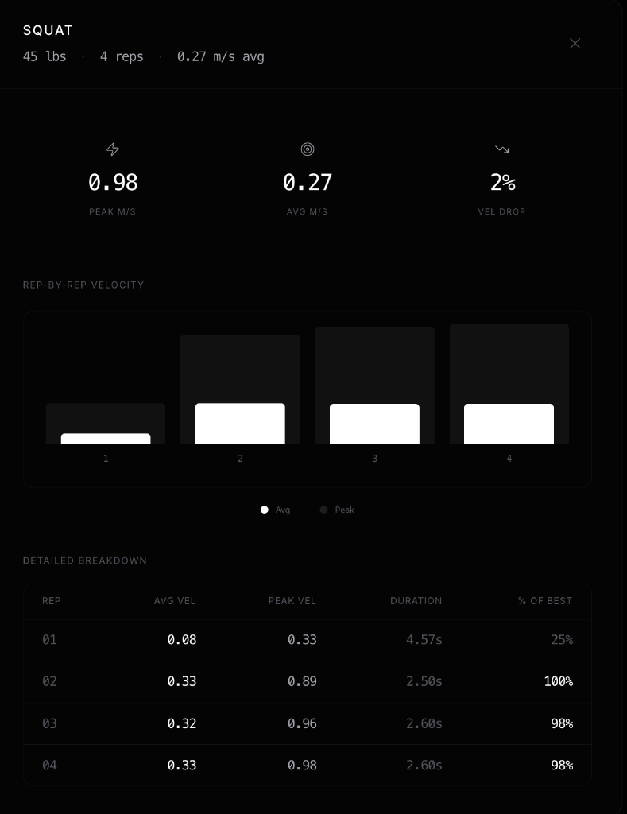

# VeloLift


> Workout logger with real-time barbell velocity tracking via Arduino rotary encoder.

A monorepo containing a **React frontend** for logging workouts and a **Python/FastAPI backend** that tracks bar velocity from a rotary encoder at 50Hz.

---

## Quick Start

### Frontend Only (no hardware)

```bash
npm install
npm run dev
```

Opens at `http://localhost:5173`. Use the terminal-style input bar to log sets.

### With Velocity Tracking

Requires an Arduino with a rotary encoder attached to the barbell cable.

```bash
npm run track          # Runs both frontend + backend
```

**First-time Python setup:**

```bash
cd velocitytracker
python3 -m venv venv && source venv/bin/activate
pip install -r requirements.txt
```

The Arduino port is auto-detected. If detection fails, set it manually in `velocitytracker/config.json`.

---

## Project Structure

```
VeloLift/
├── frontend/              # React workout logger (port 5173)
├── velocitytracker/       # Python FastAPI velocity tracker (port 8000)
├── hardware/              # 3D-printable enclosure files (.scad/.stl)
├── docs/                  # Screenshots
├── scripts/start-all.js   # Launches both services
└── package.json           # Monorepo root
```

---

## Features

### Workout Logger
- Terminal-style set entry with autocomplete
- Bento grid layout for exercises
- Calendar + list views for history
- Inline editing of sets
- Cross-workout search by exercise
- Local IndexedDB storage

### Velocity Tracker
- 50Hz real-time streaming via WebSocket
- Automatic rep counting (direction-based state machine)
- Auto-detects Arduino port

---

## Screenshots


*Clean workout logging with calendar navigation and bento grid layout*


*Rep-by-rep velocity breakdown with detailed metrics*

---

## Tech Stack

| Layer | Technology |
|-------|------------|
| **Frontend** | React 19, Vite 7, Tailwind 4, Dexie, date-fns |
| **Backend** | Python 3.9+, FastAPI, pyserial, uvicorn, pydantic |
| **Hardware** | Arduino Uno/Nano, rotary encoder, 115200 baud serial |

---

## Commands

| Command | Description |
|---------|-------------|
| `npm run dev` | Frontend only |
| `npm run track` | Frontend + velocity tracker |

---

## Arduino Code

Upload this to your Arduino Uno/Nano:

```cpp
// Rotary Encoder Pins
const int pinA = 2; // Green wire (Interrupt 0)
const int pinB = 3; // White wire (Interrupt 1)

// --- CALIBRATION ---
// Measure the diameter of the spool/wheel on your encoder.
// Example: 40mm diameter = 0.04m. Circumference = 0.04 * 3.14159 = 0.125m
const float wheelCircumference = 0.125; 
const int pulsesPerRev = 600; // Standard for many encoders
const float metersPerPulse = wheelCircumference / pulsesPerRev;

volatile long pulseCount = 0;
unsigned long lastTime = 0;

void setup() {
  Serial.begin(115200); // Fast baud rate for real-time response
  
  pinMode(pinA, INPUT_PULLUP);
  pinMode(pinB, INPUT_PULLUP);

  // Trigger handleEncoder() every time Pin 2 goes from LOW to HIGH
  attachInterrupt(digitalPinToInterrupt(pinA), handleEncoder, RISING);
  
  Serial.println("--- Barbell Tracker: CALIBRATED ---");
}

void loop() {
  unsigned long currentTime = millis();
  
  // Update every 100ms (10 times per second)
  if (currentTime - lastTime >= 100) {
    
    // Grab pulse count safely
    noInterrupts();
    long currentPulses = pulseCount;
    pulseCount = 0; 
    interrupts();

    // Velocity = (Distance) / (Time)
    float velocity = (currentPulses * metersPerPulse) / 0.1;

    // Only print if there's significant movement (ignore jitter)
    if (abs(velocity) > 0.05) {
      Serial.println(velocity, 2);  // Signed velocity: + = UP, - = DOWN
    }

    lastTime = currentTime;
  }
}

// Interrupt Service Routine: Runs instantly on pulse
void handleEncoder() {
  // Check Pin 3 to determine direction
  // FLIPPED: Now UP = positive, DOWN = negative
  if (digitalRead(pinB) == HIGH) {
    pulseCount--;  // DOWN = negative
  } else {
    pulseCount++;  // UP = positive
  }
}
```

**Wiring:**
- Pin 2 → Encoder A (Green)
- Pin 3 → Encoder B (White)
- VCC → 5V
- GND → GND

---

## Documentation

See **[SYSTEM_OVERVIEW.md](SYSTEM_OVERVIEW.md)** for detailed architecture, API reference, data flow, and WebSocket schemas.

---

## License

MIT
